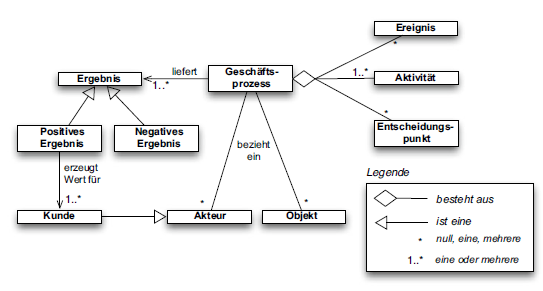
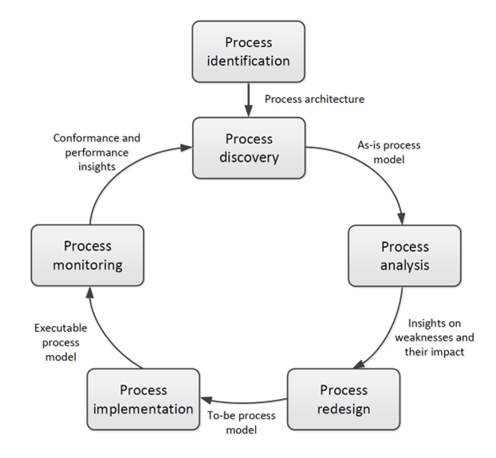

# Einführung ins Geschäftsprozessmanagement

Titel | Einführung ins Geschäftsprozessmanagement
---   | ---
Modul | 254 Informatiker/in EFZ (PE und AE)
Autor | Jürg Haller, Anpassungen Tobias Hefti
Nachweis | Abgabe der Ergebnisse siehe Kriterien im Anhang
Sozialform | Einzelarbeit / Partnerarbeit
Leistungsziele | LZ 1.1 – 1.6

## Ausgangslage
Als Lernende und als Privatpersonen sind sie tagtäglich entweder Akteur:innen oder Kund:innen von Geschäftsprozessen. So möchten Sie zum Beispiel beim Einkaufen vor Ort oder online, dass das gewünschte Produkt verfügbar, der Bestell- und Zahlungsablauf einfach und sicher ist und Sie die Ware entweder gerade mitnehmen können oder diese bei Online-Bestellungen innerhalb eines Tages ausgeliefert wird. Dabei zählen Sie darauf, dass die Firma ihre Prozesse im Griff hat. Dies gilt ebenso für die Schule und Ihren Ausbildungsbetrieb.

In diesem Lern- und Arbeitsauftrag lernen Sie häufige Geschäftsprozesse und deren Bestandteile kennen und wenden das Wissen auf eigene Beispiele an.
Zusätzliche erarbeiten Sie eine Beschreibung des Begriffs Geschäftsprozessmanagement und dessen Lebenszyklus.

## Aufgabenstellung

### Teil 1

Es stehen Ihnen folgende Ressourcen zur Verfügung, nutzen Sie diese für die Informationsbeschaffung.

- Kapitel 1.1 und 1.2 des Buches «Grundlagen des Geschäftsprozessmanagements» (Siehe Begleitmaterial / Dumas_Grundlagen-des-Geschaeftsprozes_9783662587362.pdf)
- https://www.youtube.com/watch?v=37CXpUnXtnw
- https://www.youtube.com/watch?v=P6FWt5xdWwc&list=PL9iw99lS3Prj5VoC4Bwhmj9Wawd2r-Vtt&index=2&t=33s 
- https://www.youtube.com/watch?v=PcOz_i1tAt8&list=PL9iw99lS3Prj5VoC4Bwhmj9Wawd2r-Vtt&index=3 
- https://panopto.ut.ee/Panopto/Pages/Viewer.aspx?id=cea55029-07d7-4c78-8c64-a9f2008eadce
- https://www.youtube.com/watch?v=O1GzketYs3U 

Notieren Sie sich in einigen Sätzen je zwei Geschäftsprozesse, in denen Sie Kund:in oder Akteur:in, aber keine Kund:in sind. (Optional: Erläutern Sie die Beispiele ihrer Kolleg:in)

Erstellen Sie:
- eine Liste mit häufigen Geschäftsprozessen (z.B. siehe Seite 2, Kapitel 1 im Buch), inkl. kurzer Beschreibung und kategorisieren Sie die eigenen vier Beispiele. 

- eine Übersicht über die Bestandteile eines Geschäftsprozesses (Auflistung oder grafisch aufbereitet) und wenden Sie das Modell auf zwei ihrer Beispiele an. (LZ 1.2, 1.3)

### Teil 2

Jeder Geschäftsprozess weist einen Lebenszyklus auf. Dieser Zyklus setzt sich aus den folgenden Phasen zusammen und wird in der Gesamtheit Geschäftsprozessmanagement genannt (Business Process Management).

Informieren Sie sich zum Modell mit Hilfe der folgenden Ressourcen:

- Kapitel 1.4 des Buches «Grundlagen des Geschäftsprozessmanagements» (siehe Siehe Begleitmaterial)
- https://www.youtube.com/watch?v=Q0ueZDLs8rc&list=PL9iw99lS3Prj5VoC4Bwhmj9Wawd2r-Vtt&index=5

Wählen Sie anschliessend eines ihrer im vorgängigen Abschnitt genutzten Beispiele und schreiben Sie zu jeder Phase auf was dies konkret bedeutet.

Definition BPM: Beachten Sie, dass BPM als Kürzel sowohl für Business Process Management als auch Business Process Modeling genutzt werden kann. 

## Gütekriterien
Der Lern- und Arbeitsauftrag ist erfüllt, wenn …
- Sie vier eigene Geschäftsfälle beschrieben und kategorisiert haben.
- Sie für zwei Geschäftsprozesse deren Bestandteile identifiziert haben
- Sie die Phasen des Geschäftsprozessmanagements auf eines Ihrer Beispiele angewandt und beschrieben haben, was in der jeweiligen Phase passiert.
- Sie den Inhalt in einer für Sie geeigneten Form im Lernjournal zusammengefasst haben.

## Zusätzliche Angaben zum Auftrag
- Keine

## Mögliche Erweiterungsaufträge
Das Kapitel 1 im Buch «Einführung in das Geschäftsprozessmanagement» bietet weitere Vertiefungsmöglichkeiten:

Sie können die Aufgaben der Kapitel 1.1, 1.2 und 1.4 lösen. Die Lösungen finden sich im Kapitel 1.6

Das Kapitel 1.3 lesen oder das passende Video anschauen: https://www.youtube.com/watch?v=yOVeV0IMCAE&list=PL9iw99lS3Prj5VoC4Bwhmj9Wawd2r-Vtt&index=4 

Weitere Übungsaufgaben finden Sie im Kapitel 1.7

