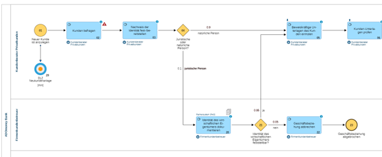
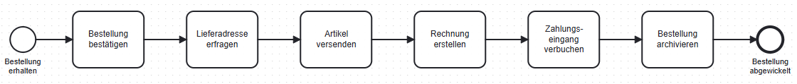

# Erste Schritte mit der BPMN

Titel | Erste Schritte mit der BPMN
---   | ---
Modul | 254 Informatiker/in EFZ (PE und AE)
Autor | Jürg Haller, Anpassungen Tobias Hefti
Nachweis | Abgabe der Ergebnisse siehe Kriterien im Anhang
Sozialform | Einzelarbeit / Partnerarbeit
Leistungsziele | LZ 2.1 - 2.4

## Ausgangslage

Zur Darstellung von Geschäftsprozessen existiert eine international anerkannte [Norm](https://www.omg.org/spec/BPMN/) an der sich die meisten Firmen orientieren. Jede ISO zertifizierte Firma muss ihre wichtigsten Prozesse dokumentieren. Sie können also bei Ihnen im Betrieb oder auch am BBZ Darstellungen wie hier finden.

In diesem Lern- und Arbeitsauftrag installieren Sie ein Tool zur Darstellung Prozessen und lernen die grundlegenden Symbole und den Einsatzzweck dieser Modelle kennen.

## Aufgabenstellung

Wir verwenden Camunda Modeler zum zeichen und visualisieren von BPMNs. Camunda Modeler ist unter diesem [Link](https://camunda.com/download/modeler/) verfügbar. Camunda Modeler benötigt eine lokale Java Umgebung, Java erhalten Sie von
   [Oracle](https://www.oracle.com/technetwork/java/javase/downloads/index.html) 
   oder [OpenJDK](https://jdk.java.net/25/).

Erstellen Sie als erstes das folgende Sequenzdiagramm.

> **Hinweis:**
> Mehrzeilige Beschriftungen können mit `[SHIFT] + [ENTER]` eingegeben werden.

## Grundlagen BPMN
Business Process Model and Notation (BPMN) heisst die oben verwendete Darstellungssprache.

Öffnen Sie [bpmn\KP.01.00_Neukunde-anlegen_de.bpmn](./bpmn/KP.01.00_Neukunde-anlegen_de.bpmn) in Camunda Modeler und analysieren Sie diesen bezüglich folgenden Fragestellungen:

-	Wie werden Ereignisse, Aktivitäten und Sequenzen dargestellt? (LZ 2.1)
-	Werden die Bezeichnungsregeln gemäss Empfehlungen der Ressourcen eingehalten? (LZ 2.2)
-	Beschreiben Sie für die ersten zwei Schritte, was im Prozess passiert. (LZ 2.3)
-	Ist dies ein konzeptionelles oder ausführbares Prozessmodell? (LZ 2.4)

Nutzen Sie zur Beantwortung der Fragen die folgenden Ressourcen:
-	Kapitel 3.1 des Buches «Grundlagen des Geschäftsprozessmanagements» (siehe Begleitmaterial)
-	https://www.youtube.com/watch?v=WSmwhB7jTcw&list=PL9iw99lS3Prj5VoC4Bwhmj9Wawd2r-Vtt&index=10 
-	https://panopto.ut.ee/Panopto/Pages/Viewer.aspx?id=f6da01c3-d9bd-4953-bcc1-aa00008a52bb (die ersten 10 Minuten)

## Sequenzdiagramm anwenden
Sie haben im [LA_0501](./LA_0501_Einführung_GPM.md) eigene einfache Geschäftsprozesse beschrieben. Wählen Sie einen davon aus und bilden Sie diesen noch ohne Entscheidungen und Verzweigungen als Sequenzdiagramm ab und halten Sie sich an die Bezeichnungsregeln für Modelle, Ereignisse und Aktivitäten. (LZ 2.2, LZ 2.3)

Erläutern Sie anhand des Beispiels was die Begriffe Instanz und Marke (Token) bedeuten. (LZ 2.2)

## Gütekriterien
Der Lern- und Arbeitsauftrag ist erfüllt, wenn …
- Sie in Camunda Modeler ein eigenes einfaches Sequenzdiagramm erstellt haben.
- Sie die einzelnen Elemente benennen und deren Funktion erklären können.
- Sie sich bei der Bezeichnung an die Vorgaben gehalten haben und dies auch erklären können.
- Sie ein konzeptionelles und ausführbares Prozessmodell unterscheiden und deren Einsatzzweck begründen können.
- Sie den Inhalt in einer für Sie geeigneten Form im Lernjournal zusammengefasst haben.

## Mögliche Erweiterungsaufträge
Zur Vertiefung können Sie die Übungen im Kapitel 3.1 im Buch «Grundlagen des Geschäftsprozessmanagements» lösen.
