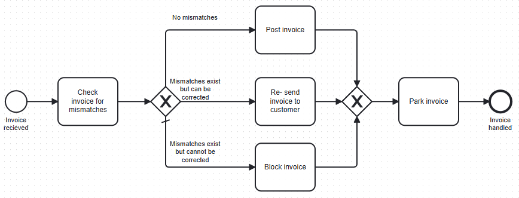
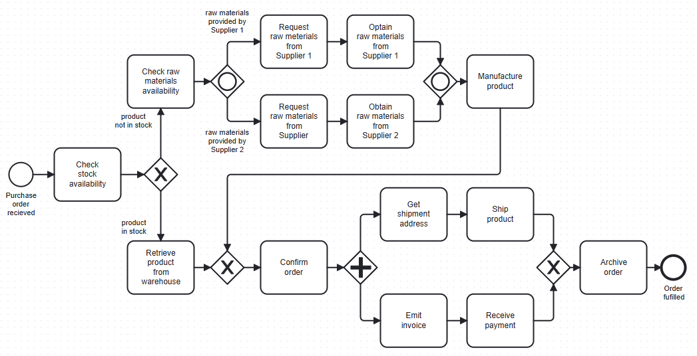

# Verzweigung und Zusammenführung in BPMN

Titel | Verzweigung und Zusammenführung in BPMN
---   | ---
Modul | 254 Informatiker/in EFZ (PE und AE)
Autor | Jürg Haller, Anpassungen Tobias Hefti
Nachweis | Abgabe der Ergebnisse siehe Kriterien im Anhang
Sozialform | Einzelarbeit / Partnerarbeit
Leistungsziele | LZ 2.6 - 2.9

## Ausgangslage
Geschäftsprozesse laufen, wie auch Programme, nicht einfach linear vom Start zum Ziel. Entscheidungen müssen getroffen werden und Sequenzen wiederholt. Somit benötigt BPMN auch eine Notation für Logik.
In diesem Auftrag lernen Sie, wie logische AND, ODER oder XOR in Verzweigungen und Zusammenführungen dargestellt und wie diese Funktionen eingesetzt werden.

## Aufgabenstellung
### Symbole und Funktion
In den folgenden Ressourcen werden Ihnen Symbole und Funktion von exklusiven (XOR), nicht exklusiven (AND) sowie inklusiven (OR) Gateways vorgestellt.
Sie sollten anschliessend die Symbole der logischen Gatter deren Funktion zuweisen können.

-	Kapitel 3.2 des Buches «Grundlagen des Geschäftsprozessmanagements» (siehe Begleitmaterial)
-	https://www.youtube.com/watch?v=ugmvYIckSrM&list=PL9iw99lS3Prj5VoC4Bwhmj9Wawd2r-Vtt&index=11
-	BPMN Poster im Begleitmaterial

### XOR, AND, OR anwenden
Beschreiben Sie das folgende Prozessmodell in Textform in eigenen Worten. 
Nutzen Sie dazu die Ressourcen der vorhergehenden Aufgabe. (LZ 2.7)

### XOR sowie AND anwenden
Sie haben im [LA_0501](./LA_0501_Einführung_GPM.md) eigene Geschäftsprozesse beschrieben. Wählen Sie einen davon aus und bilden Sie diesen ab. (LZ 2.8)

### OR anwenden
Ergänzen Sie den obigen Geschäftsprozess mit zusätzlichen Entscheidungen, die ein inklusives Gateway benötigen. (LZ 2.9)

## Gütekriterien
Der Lern- und Arbeitsauftrag ist erfüllt, wenn …
- Sie den Beispielprozess mit eigenen Worten erklärt haben.
- Sie ein eigenes Beispiel mit XOR und AND Gateways modelliert haben.
- Sie ein eigenes Beispiel mit OR Gateways modelliert haben.
- Sie den Inhalt in einer für Sie geeigneten Form im Lernjournal zusammengefasst haben.

## Mögliche Erweiterungsaufträge

1.	Informieren Sie sich über das «ereignisbasierte Gateway» und modellieren Sie ein entsprechendes Beispiel. Material: Buch «Grundlagen des Geschäftsprozessmanagements»

2.	Zur Vertiefung können Sie die Übungen im Kapitel 3.2 im Buch «Grundlagen des Geschäftsprozessmanagements» lösen.

