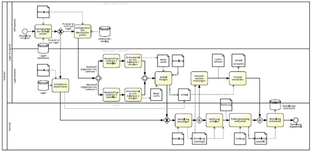

# Geschäftsprozess mit Ressourcen darstellen

Titel | Geschäftsprozess mit Ressourcen darstellen
---   | ---
Modul | 254 Informatiker/in EFZ (PE und AE)
Autor | Jürg Haller, Anpassungen Tobias Hefti
Nachweis | Abgabe der Ergebnisse siehe Kriterien im Anhang
Sozialform | Einzelarbeit / Partnerarbeit
Leistungsziele | LZ 3.1 - 3.5

## Ausgangslage
Ein weiteres wichtiges Element in der Darstellung eines Geschäftsprozesses sind die verwendeten Objekte und Ressourcen. Sie haben bereits im ersten Auftrag in diesem Modul den Begriff Akteure kennengelernt, diese sollten ebenfalls abgebildet werden können, wie auch zum Beispiel das Datenobjekt «Bestellbestätigung» welches an den Kunden geschickt wird.

## Aufgabenstellung

### Darstellung (LZ 3.1, LZ 3.2)
Es stehen Ihnen folgende Ressourcen zur Verfügung, nutzen Sie diese für die Informationsbeschaffung.

-	Kapitel 3.3 (S. 105 – 109) des Buches «Grundlagen des Geschäftsprozessmanagements» (siehe Begleitmaterial)
-	https://www.youtube.com/watch?v=9YpCgnSByiQ&list=PL9iw99lS3Prj5VoC4Bwhmj9Wawd2r-Vtt&index=12  

Beschreiben Sie in eigenen Worten, was Geschäftsobjekte, Datenobjekt und Datenspeicher sind und welche Funktion sie haben.
Im Buch finden Sie Symbole zur Darstellung, vergleichen Sie diese mit der Implementation in Camunda Modeler und beschreiben Sie diese. 

### Datenobjekte, -speicher und Informationsfluss anwenden (LZ 3.3)

Nehmen Sie das in den letzten Lern- und Arbeitsaufträgen verwendete Beispiel, oder ein anderes Ihrer Wahl und ergänzen Sie das Prozessmodell mit Datenobjekten, Datenspeicher und falls Sie bereits Pools oder Lanes einsetzen, mit Verbindungen, die einen Informationsfluss zeigen.

### Darstellung von Ressourcen (LZ 3.4, LZ 3.5)
Es stehen Ihnen folgende Ressourcen zur Verfügung, nutzen Sie diese für die Informationsbeschaffung.

-	Kapitel 3.4 (S. 109 – 116) des Buches «Grundlagen des Geschäftsprozessmanagements» (siehe Begleitmaterial)
-	https://www.youtube.com/watch?v=oAUVFROVRPg&list=PL9iw99lS3Prj5VoC4Bwhmj9Wawd2r-Vtt&index=13 

Nehmen Sie das in den letzten Lern- und Arbeitsaufträgen verwendete Beispiel, oder ein anderes Ihrer Wahl und ergänzen Sie das Prozessmodell mit Pools, um Ressourcen und die Interaktion zwischen einzelnen Akteuren darzustellen. (LZ 3.5)

## Gütekriterien
Der Lern- und Arbeitsauftrag ist erfüllt, wenn …
- Sie die einzelnen Teilaufträge vollständig ausgeführt haben.
- Sie den Inhalt in einer für Sie geeigneten Form im Lernjournal zusammengefasst haben.

## Zusätzliche Angaben zum Auftrag
- Keine

## Mögliche Erweiterungsaufträge
- Lösen Sie die Übungsaufgaben im Kapitel 3.4 oder die passenden weiteren Übungsaufgaben im Kapitel 3.9

